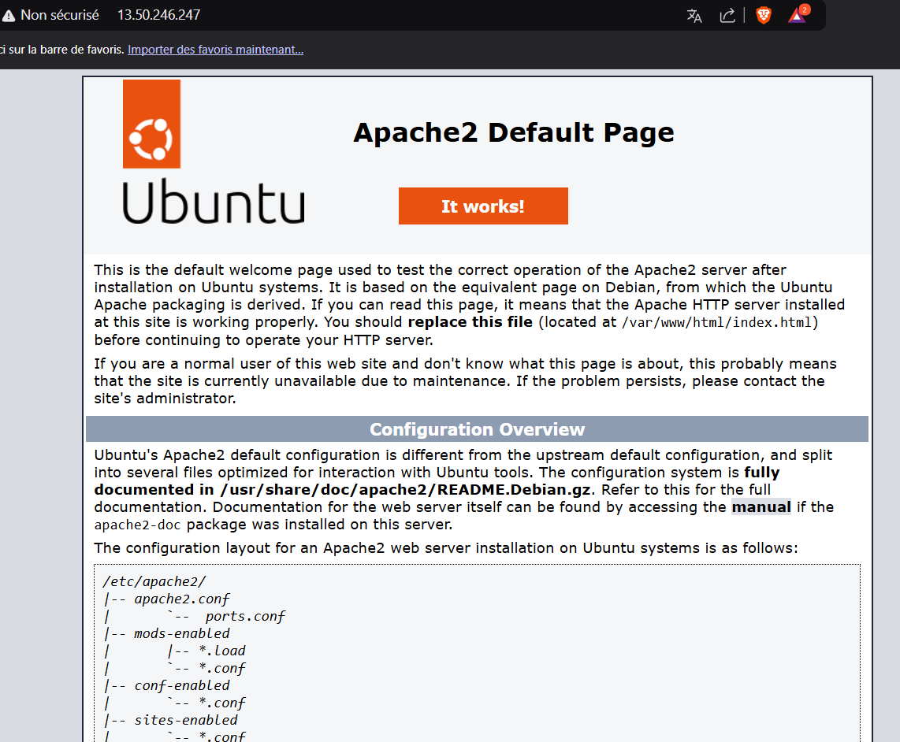

## EX-01 CLOUD

### I/ Comparation

> Voici le tableau comparatif des différentes instances disponibles à usage général, correpondant au criètes demandées:

| Région    | Nom de l'instance | Tarif horaire à la demande | vCPU | Mémoire | Stockage       | Performances réseau |
| --------- | ----------------- | -------------------------- | ---- | ------- | -------------- | ------------------- |
| Stockholm | t4g.small         | 0,0172 USD                 | 2    | 2 GiB   | EBS uniquement | Jusqu’à 5 gigabits  |
| Espagne   | t4g.small         | 0,0184 USD                 | 2    | 2 GiB   | EBS uniquement | Jusqu’à 5 gigabits  |
| Paris     | t4g.small         | 0,0188 USD                 | 2    | 2 GiB   | EBS uniquement | Jusqu’à 5 gigabits  |
| Milan     | t4g.small         | 0,0192 USD                 | 2    | 2 GiB   | EBS uniquement | Jusqu’à 5 gigabits  |
| Irlande   | t3a.small         | 0,0204 USD                 | 2    | 2 GiB   | EBS uniquement | Jusqu’à 5 gigabits  |
| Paris     | t3a.small         | 0,0212 USD                 | 2    | 2 GiB   | EBS uniquement | Jusqu’à 5 gigabits  |
| Londres   | t3a.small         | 0,0216 USD                 | 2    | 2 GiB   | EBS uniquement | Jusqu’à 5 gigabits  |
| Zurich    | t4g.small         | 0,0211 USD                 | 2    | 2 GiB   | EBS uniquement | Jusqu’à 5 gigabits  |
| Stockholm | t3.small          | 0,0216 USD                 | 2    | 2 GiB   | EBS uniquement | Jusqu’à 5 gigabits  |
| Irlande   | t3.small          | 0,0228 USD                 | 2    | 2 GiB   | EBS uniquement | Jusqu’à 5 gigabits  |
| Paris     | t3.small          | 0,0236 USD                 | 2    | 2 GiB   | EBS uniquement | Jusqu’à 5 gigabits  |
| Milan     | t3.small          | 0,024 USD                  | 2    | 2 GiB   | EBS uniquement | Jusqu’à 5 gigabits  |
| Irlande   | t2.small          | 0,025 USD                  | 1    | 2 GiB   | EBS uniquement | Faible à modéré     |
| Londres   | t2.small          | 0,026 USD                  | 1    | 2 GiB   | EBS uniquement | Faible à modéré     |
| Paris     | t2.small          | 0,0264 USD                 | 1    | 2 GiB   | EBS uniquement | Faible à modéré     |
| Francfort | t2.small          | 0,0268 USD                 | 1    | 2 GiB   | EBS uniquement | Faible à modéré     |

En conclusion, l'instance qui respecte le mieux les critères est la t4g.small

### II/ Déploiement Apache

```
ubuntu@ip-172-31-11-33:~$ sudo apt update
Hit:1 http://ports.ubuntu.com/ubuntu-ports noble-security InRelease
Hit:2 http://eu-north-1c.clouds.ports.ubuntu.com/ubuntu-ports noble InRelease
Hit:3 http://eu-north-1c.clouds.ports.ubuntu.com/ubuntu-ports noble-updates InRelease
Hit:4 http://eu-north-1c.clouds.ports.ubuntu.com/ubuntu-ports noble-backports InRelease
Reading package lists... Done
Building dependency tree... Done
Reading state information... Done
All packages are up to date.

```

```
ubuntu@ip-172-31-11-33:~$ sudo systemctl status apache2
● apache2.service - The Apache HTTP Server
     Loaded: loaded (/usr/lib/systemd/system/apache2.service; enabled; preset: enabled)
     Active: active (running) since Mon 2025-02-03 13:34:19 UTC; 9s ago
       Docs: https://httpd.apache.org/docs/2.4/
   Main PID: 8429 (apache2)
      Tasks: 55 (limit: 2196)
     Memory: 5.0M (peak: 5.2M)
        CPU: 34ms
     CGroup: /system.slice/apache2.service
             ├─8429 /usr/sbin/apache2 -k start
             ├─8431 /usr/sbin/apache2 -k start
             └─8432 /usr/sbin/apache2 -k start
```



### III/ Infos instance

- ID de l'instance (instance ID)

**i-0553ac4f062e333f4**

- Type d'instance (Instance type)

**t4g.small**

- ID de l'AMI (AMI ID)

**ami-001e33773aec8d45f**

- L'IP publique associée à l'instance (Public IPv4 address)

**13.50.246.247**

- Le FQDN public associé à l'instance (Public IPv4 DNS)

**ec2-13-50-246-247.eu-north-1.compute.amazonaws.com**

- L'IP privée associée à l'instance (Private IPv4 address)

**172.31.11.33**

- L'ID du VPC dans lequel est déployée l'instance (VPC ID)

**vpc-0424f1e027d7cfe2b**

- L'ID du sous-réseau dans lequel est déployée l'instance (Subnet ID)

**subnet-002fab227991c2b1c**

- L'AZ dans laquelle est déployée l'instance (Availability Zone)

**eu-north-1c**

- L'ID de l'interface réseau associée à l'instance (Network Interface ID)

**eni-085c6dc5a83ce14fe**

- L'ID du volume attaché à l'instance (EBS Volume ID)

**vol-05bec1f9b36dc9280**

- La taille du volume attaché à l'instance (EBS Volume Size)

**8 GiB**
