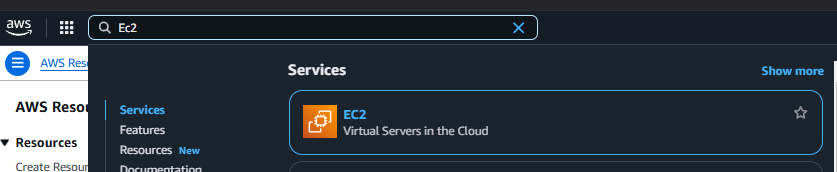
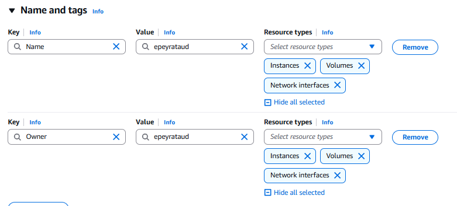
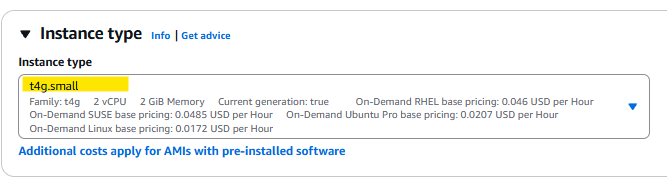
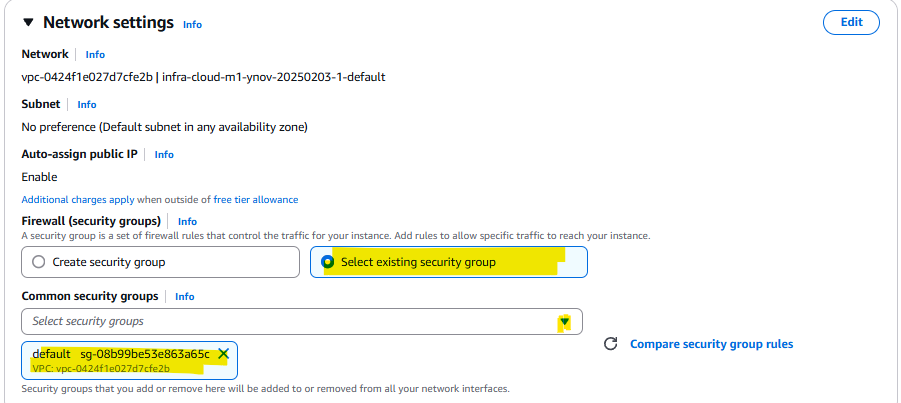
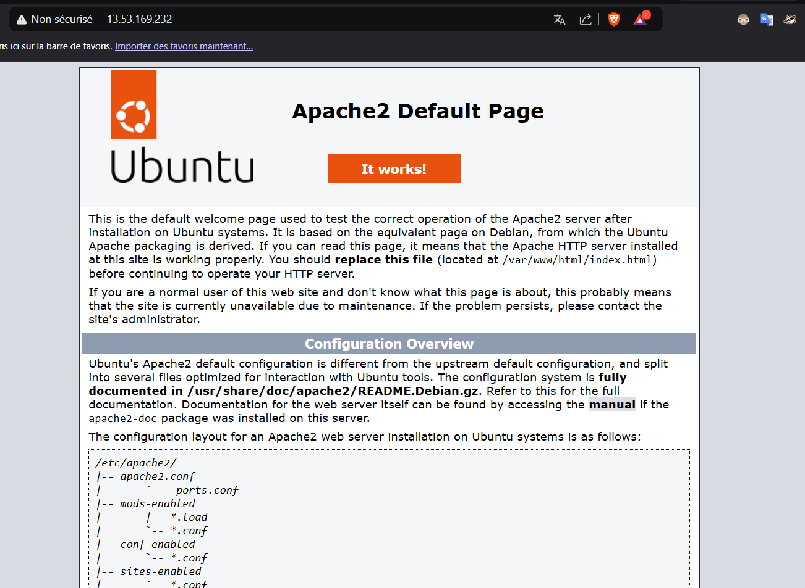

## EX-03 CLOUD

### I/ Supprimer les resources de l'instance


### II/ Documentation

#### Etape 1: déploiement de l'instance (10 minutes)

- Sur AWS, rechercher dans la barre de recherche `EC2`



- Cliquez sur `launch instance`


- Cliquez ensuite sur `Add additional tags`


- Ajoutez les tags avec les valeurs suivantes :



- Choisissez l'OS `Ubuntu` en version 24.04, puis l'architecture `64-bit ARM` (important pour le choix du type de l'instance juste après)
  

- Pour le type d'instance, choisissez l'instance `t4g.small`:



- Pour le choix du `security group`, cliquez sur `Select existing security group`, puis en dans `Common security groups`, selectionnez le groupe `default`



- Cliquez sur `launch instance`


- Pour l'étape du SSH, si pas besoin de clé, sélectionnez `Proceed without key pair` et cliquez sur `launch instance`


- Retournez sur le Dashboard, puis cliquez sur `instance (running)`


- Cliquez sur l'instance ID de votre instance

- Cliquez sur `connect` puis `connect`

#### Etape 2: Lancement de l'instance et installation d'un service web apache2 (5 minutes)

- Depuis le terminal, lancez la commande suivante `sudo apt update && apt upgrade -y` pour mettre à jour les paquets.

- Une fois à jour, lancez la commande `sudo apt install apache2 -y`

- Une fois termineé, lancez la commande `sudo systemctl status apache2` pour vérifier le bon fonctionnement du service `apache2`

```
ubuntu@ip-172-31-14-76:~$ sudo systemctl status apache2
● apache2.service - The Apache HTTP Server
     Loaded: loaded (/usr/lib/systemd/system/apache2.service; enabled; preset: enabled)
     Active: active (running) since Mon 2025-02-03 14:43:25 UTC; 17s ago
       Docs: https://httpd.apache.org/docs/2.4/
   Main PID: 2217 (apache2)
      Tasks: 55 (limit: 2196)
     Memory: 5.2M (peak: 5.3M)
        CPU: 36ms
     CGroup: /system.slice/apache2.service
             ├─2217 /usr/sbin/apache2 -k start
             ├─2219 /usr/sbin/apache2 -k start
             └─2220 /usr/sbin/apache2 -k start
```

- Depuis votre navigateur, sur la barre url, lancez `http://ip.de.votre.instance`



- Bravo, votre service `apache2` est déployée ! :)
