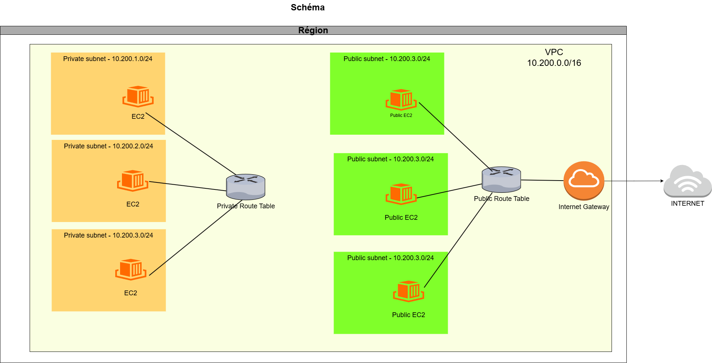

## EX-01

### I/ Information VPC

VPC : `vpc-094992ed2fc3a117b`
Nom: `epeyrataud-vpc`
Plage d'adresses IP : `10.200.0.0/16`

Subnets :
Nom : `epeyrataud-subnet-public1-eu-north-1a`
Plage d'adresses IP :`10.200.1.0/24`
AZ : eu-north-1a
Route table associée : `rtb-0ca25cd9ab26909ac | epeyrataud-rtb-public`

Nom : `epeyrataud-subnet-public2-eu-north-1b`
Plage d'adresses IP :`10.200.2.0/24`
AZ : eu-north-1b
Route table associée : `rtb-0ca25cd9ab26909ac | epeyrataud-rtb-public`

Nom : `epeyrataud-subnet-public3-eu-north-1c`
Plage d'adresses IP :`10.200.3.0/24`
AZ : eu-north-1c
Route table associée : `rtb-0ca25cd9ab26909ac | epeyrataud-rtb-public`

Nom : `epeyrataud-subnet-private1-eu-north-1a`
Plage d'adresses IP :`10.200.4.0/24`
AZ : eu-north-1a
Route table associée : `rtb-0928e03e286c2e9e4 | epeyrataud-rtb-private1-eu-north-1a`

Nom : `epeyrataud-subnet-private2-eu-north-1b`
Plage d'adresses IP :`10.200.5.0/24`
AZ : eu-north-1b
Route table associée : `rtb-0a1110860e9accfad | epeyrataud-rtb-private2-eu-north-1b`

Nom : `epeyrataud-subnet-private3-eu-north-1c`
Plage d'adresses IP :`10.200.6.0/24`
AZ : eu-north-1c
Route table associée : `rtb-0db96bb7507e01a45 | epeyrataud-rtb-private3-eu-north-1c`

Internet Gateway :
ID : `igw-0cd3e167dbb517308`
Nom `epeyrataud-igw`

Route tables :
ID : `rtb-0928e03e286c2e9e4`
Nom : `epeyrataud-rtb-private1-eu-north-1`
Route : `10.200.0.0/16`

Route tables :
ID : `rtb-0a1110860e9accfad`
Nom : `epeyrataud-rtb-private1-eu-north-1b`
Route : `10.200.0.0/16`

Route tables :
ID : `rtb-0db96bb7507e01a45`
Nom : `epeyrataud-rtb-private1-eu-north-1c`
Route : `10.200.0.0/16`

Route tables :
ID : `rtb-0ca25cd9ab26909ac`
Nom : `epeyrataud-rtb-public`
Route : `10.200.0.0/16` `0.0.0.0/0`

Route tables :
ID : `rtb-0cbcc64b6ba6c54c3`
Nom : `epeyrataud-main`
Route : `10.200.0.0/16`

Liste de control d'accès par défaut (ACL) :
`acl-0edcc607918962fe1`
Nom : `epeyrataud-acl`

Security Group par défaut :
`sg-0455f797fa23a670f`
Nom: `epeyrataud-sg`

### II/ Schéma Réseau Architecture AWS

