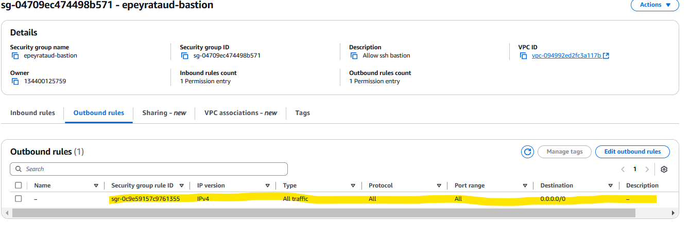
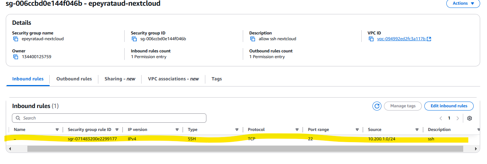
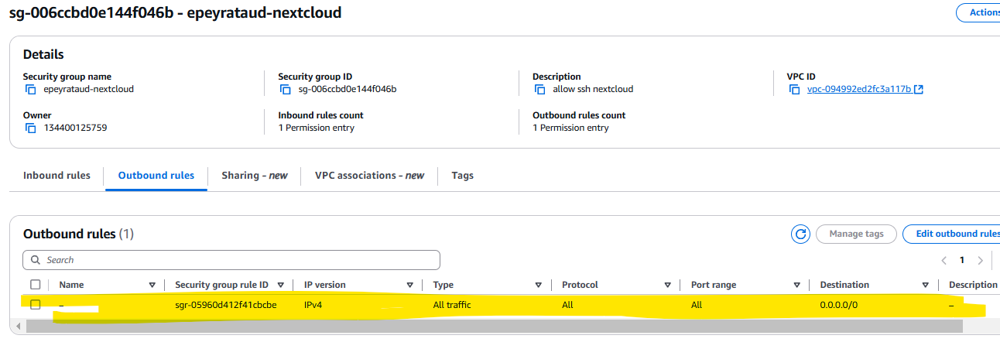
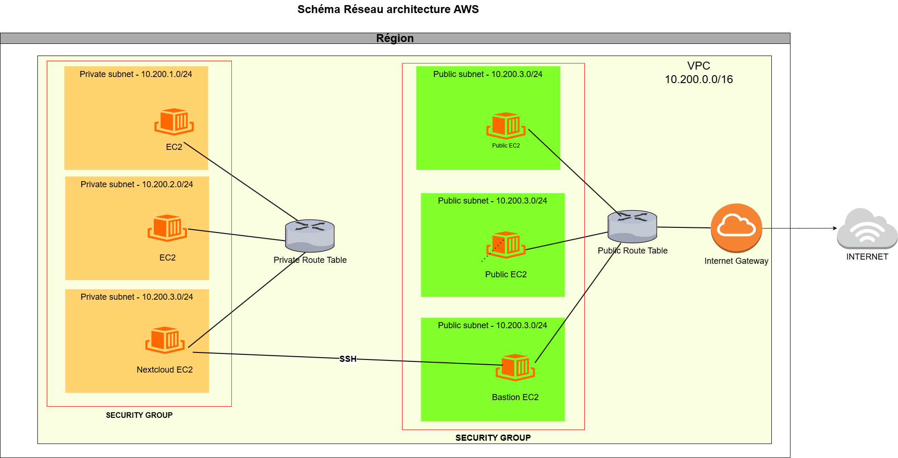
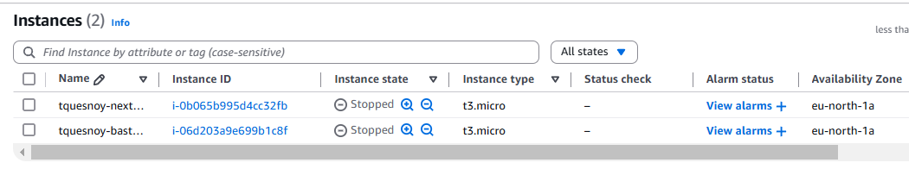
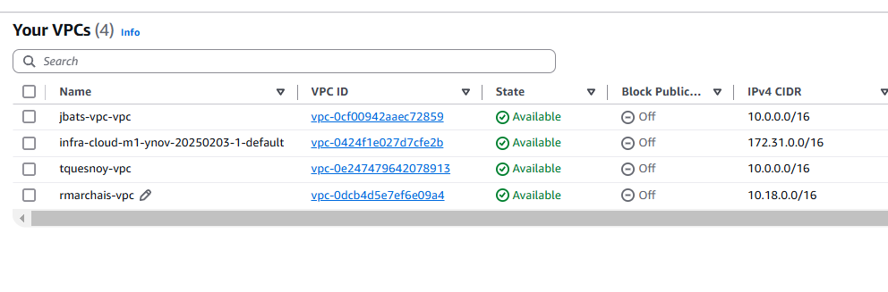

## EX-02

### I/ Récupération des informations

##### Bastion:

- ID : `i-0cecef24d173ba3e9`

- Nom : `epeyrataud-bastion`

- Type : `t3.micro`

- IP publique : `51.20.250.169`

- IP privée : `10.200.1.223`

- Subnet associé : `subnet-051ab85919348d1d2`

- Security Group associé : `sg-04709ec474498b571`

- Key Pair associé : `epeyrataud.key.bastion`

##### Nextcloud:

- ID : `i-07c7faf19b02f425b`

- Nom : `epeyrataud-nextcloud`

- Type : `t3.micro`

- IP publique : `X`

- IP privée : `10.200.4.167`

- Subnet associé : `subnet-015c7aa9d8cc8f3d2`

- Security Group associé : `sg-006ccbd0e144f046b`

- Key Pair associé : `epeyrataud.key.nextcloud`

#### Security Groups:

##### Bastion

- ID : `sg-04709ec474498b571`
- Nom :`epeyrataud-bastion`
- Règles entrantes :
  
- Règles sortantes :
  

- ID : `sg-006ccbd0e144f046b`
- Nom :`epeyrataud-nextcloud`
- Règles entrantes :
  
- Règles sortantes :
  

#### Network ACL :

ID : `acl-0edcc607918962fe1`
Nom : `epeyrataud-acl`
Règles entrantes :


Règles sortantes :


##### Nextcloud

### II/Configuration .ssh/config

```
[...]
Host bastion
   Hostname 51.20.250.169
   User ubuntu
   IdentitiesOnly yes
   IdentityFile epeyrataud.key.bastion.pem

Host nextcloud
   Hostname 10.200.4.167
   User ubuntu
   Proxycommand ssh -W %h:%p bastion
   IdentityFile epeyrataud.key.nextcloud.pem
```

- Vérification connexion

##### Bastion

```
C:\Users\lucas\.ssh>ssh bastion
Welcome to Ubuntu 24.04.1 LTS (GNU/Linux 6.8.0-1021-aws x86_64)

[...]

ubuntu@ip-10-200-1-223:~$ exit
logout
Connection to 51.20.250.169 closed.
```

##### Nextcloud

```
C:\Users\lucas\.ssh>ssh bastion
Welcome to Ubuntu 24.04.1 LTS (GNU/Linux 6.8.0-1021-aws x86_64)
[...]

ubuntu@ip-10-200-1-223:~$ exit
logout
Connection to 51.20.250.169 closed.
```

### III/ Schéma



### IV/ Suppression des ressources

Aucune ressource lié au tag name `epeyrataud` est existant :


