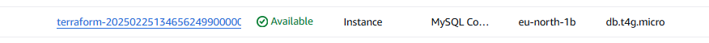

## TP-06

#### **Connexion à la BDD et listage des DB**

```
ubuntu@ip-10-0-4-45:~$ mysql -h terraform-20250225134656249900000001.c2oopr9eothp.eu-north-1.rds.amazonaws.com -u enzo -p
Enter password:
Welcome to the MySQL monitor.  Commands end with ; or \g.
Your MySQL connection id is 46
Server version: 8.0.40 Source distribution

Copyright (c) 2000, 2025, Oracle and/or its affiliates.

Oracle is a registered trademark of Oracle Corporation and/or its
affiliates. Other names may be trademarks of their respective
owners.

Type 'help;' or '\h' for help. Type '\c' to clear the current input statement.

mysql> show databases
    ->
    ->
    ->
    ->
    -> ^C
mysql> SHOW DATABASES;
+--------------------+
| Database           |
+--------------------+
| information_schema |
| mydb               |
| mysql              |
| performance_schema |
| sys                |
+--------------------+
5 rows in set (0.01 sec)
```

### Création et lecture des données

```
mysql> CREATE DATABASE testdb;
Query OK, 1 row affected (0.01 sec)

mysql> USE testdb;
Database changed
mysql> CREATE TABLE users (id INT AUTO_INCREMENT PRIMARY KEY, name VARCHAR(100));
Query OK, 0 rows affected (0.08 sec)

mysql> INSERT INTO users (name) VALUES ('Toto');
Query OK, 1 row affected (0.00 sec)
```

- Vérifier l'insertion des données :

```
mysql> SELECT * FROM USERS;
ERROR 1146 (42S02): Table 'testdb.USERS' doesn't exist
mysql> SELECT * FROM users;
+----+------+
| id | name |
+----+------+
|  1 | Toto |
+----+------+
1 row in set (0.00 sec)
```

### Haute Disponibilité

#### **Déclenchement d'un failover RDS**

- Rebooter l'instance RDS pour simuler un failover :

```
aws --profile formation-infra-cloud rds reboot-db-instance --db-instance-identifier terraform-20250225134656249900000001 --force-failover --region eu-north-1

```

**Résultats** :

```
users:~/environment/tp06-ex01 $ aws --profile formation-infra-cloud rds reboot-db-instance --db-instance-identifier terraform-20250225134656249900000001 --force-failover --region eu-north-1
{
    "DBInstance": {
        "DBInstanceIdentifier": "terraform-20250225134656249900000001",
        "DBInstanceClass": "db.t4g.micro",
        "Engine": "mysql",
        "DBInstanceStatus": "rebooting",
        "MasterUsername": "enzo",
        "DBName": "mydb",
        "Endpoint": {
            "Address": "terraform-20250225134656249900000001.c2oopr9eothp.eu-north-1.rds.amazonaws.com",
            "Port": 3306,
            "HostedZoneId": "Z3MPDEQW7KHUGY"
        },
        "AllocatedStorage": 10,
        "InstanceCreateTime": "2025-02-25T13:50:22.090000+00:00",
        "PreferredBackupWindow": "01:24-01:54",
        "BackupRetentionPeriod": 0,
        "DBSecurityGroups": [],
        "VpcSecurityGroups": [
            {
                "VpcSecurityGroupId": "sg-04e65e9efa168356f",
                "Status": "active"
            }
        ],
        "DBParameterGroups": [
            {
                "DBParameterGroupName": "default.mysql8.0",
                "ParameterApplyStatus": "in-sync"
            }
        ],
        "AvailabilityZone": "eu-north-1b",
        "DBSubnetGroup": {
            "DBSubnetGroupName": "epeyrataud-tp06-ex01-grp-rds",
            "DBSubnetGroupDescription": "Managed by Terraform",
            "VpcId": "vpc-0e2bf1a657f5dc2a9",
            "SubnetGroupStatus": "Complete",
            "Subnets": [
                {
                    "SubnetIdentifier": "subnet-01f936ce345c0f2ef",
                    "SubnetAvailabilityZone": {
                        "Name": "eu-north-1c"
                    },
                    "SubnetOutpost": {},
                    "SubnetStatus": "Active"
                },
                {
                    "SubnetIdentifier": "subnet-07b19c5f53eb27e8f",
                    "SubnetAvailabilityZone": {
                        "Name": "eu-north-1a"
                    },
                    "SubnetOutpost": {},
                    "SubnetStatus": "Active"
                },
                {
                    "SubnetIdentifier": "subnet-081c58a6b7e30ff6b",
                    "SubnetAvailabilityZone": {
                        "Name": "eu-north-1b"
                    },
                    "SubnetOutpost": {},
                    "SubnetStatus": "Active"
                }
            ]
        },
        "PreferredMaintenanceWindow": "sun:23:30-mon:00:00",
        "PendingModifiedValues": {},
        "MultiAZ": true,
        "EngineVersion": "8.0.40",
        "AutoMinorVersionUpgrade": true,
        "ReadReplicaDBInstanceIdentifiers": [],
        "LicenseModel": "general-public-license",
        "OptionGroupMemberships": [
            {
                "OptionGroupName": "default:mysql-8-0",
                "Status": "in-sync"
            }
        ],
        "SecondaryAvailabilityZone": "eu-north-1a",
        "PubliclyAccessible": false,
        "StorageType": "gp2",
        "DbInstancePort": 0,
        "StorageEncrypted": false,
        "DbiResourceId": "db-KUCQJ3UUL2Y4KLUUKWS66SAYJI",
        "CACertificateIdentifier": "rds-ca-rsa2048-g1",
        "DomainMemberships": [],
        "CopyTagsToSnapshot": false,
        "MonitoringInterval": 0,
        "DBInstanceArn": "arn:aws:rds:eu-north-1:134400125759:db:terraform-20250225134656249900000001",
        "IAMDatabaseAuthenticationEnabled": false,
        "DatabaseInsightsMode": "standard",
        "PerformanceInsightsEnabled": false,
        "DeletionProtection": false,
        "AssociatedRoles": [],
        "TagList": [
            {
                "Key": "Owner",
                "Value": "epeyrataud"
            },
            {
                "Key": "Name",
                "Value": "epeyrataud-tp06-ex01"
            }
        ],
        "CustomerOwnedIpEnabled": false,
        "BackupTarget": "region",
        "NetworkType": "IPV4",
        "StorageThroughput": 0,
        "CertificateDetails": {
            "CAIdentifier": "rds-ca-rsa2048-g1",
            "ValidTill": "2026-02-25T13:49:02+00:00"
        },
        "DedicatedLogVolume": false,
        "EngineLifecycleSupport": "open-source-rds-extended-support"
    }
}
```

#### Observation du comportement

- Vérifier la disponibilité de la base de données pendant le failover :

```
mysql -h terraform-20250225134656249900000001.c2oopr9eothp.eu-north-1.rds.amazonaws.com -u enzo -p -e "SHOW STATUS LIKE 'uptime';"
```

Résultats:

```
ubuntu@ip-10-0-4-45:~$ mysql -h terraform-20250225134656249900000001.c2oopr9eothp.eu-north-1.rds.amazonaws.com -u enzo -p -e "SHOW STATUS LIKE 'uptime';"
Enter password:
+---------------+-------+
| Variable_name | Value |
+---------------+-------+
| Uptime        | 218   |
+---------------+-------+
ubuntu@ip-10-0-4-45:~$ mysql -h terraform-20250225134656249900000001.c2oopr9eothp.eu-north-1.rds.amazonaws.com -u enzo -p -e "SHOW STATUS LIKE 'uptime';"
Enter password:
+---------------+-------+
| Variable_name | Value |
+---------------+-------+
| Uptime        | 325   |
+---------------+-------+
ubuntu@ip-10-0-4-45:~$ mysql -h terraform-20250225134656249900000001.c2oopr9eothp.eu-north-1.rds.amazonaws.com -u enzo -p -e "SHOW STATUS LIKE 'uptime';"
Enter password:
+---------------+-------+
| Variable_name | Value |
+---------------+-------+
| Uptime        | 8     |
+---------------+-------+

```

#### Changement d'AZ



#### Vérification des données

- Se reconnecter et vérifier si les données sont présentes :

```
ubuntu@ip-10-0-4-45:~$ mysql -h terraform-20250225134656249900000001.c2oopr9eothp.eu-north-1.rds.amazonaws.com -u enzo -p
Enter password:
Welcome to the MySQL monitor.  Commands end with ; or \g.
Your MySQL connection id is 9
Server version: 8.0.40 Source distribution

Copyright (c) 2000, 2025, Oracle and/or its affiliates.

Oracle is a registered trademark of Oracle Corporation and/or its
affiliates. Other names may be trademarks of their respective
owners.

Type 'help;' or '\h' for help. Type '\c' to clear the current input statement.

mysql>
mysql>
mysql> USE testdb;
Reading table information for completion of table and column names
You can turn off this feature to get a quicker startup with -A

Database changed
mysql> SELECT * FROM users;
+----+------+
| id | name |
+----+------+
|  1 | Toto |
+----+------+
1 row in set (0.00 sec)

```

### **Conclusion**

- Ce POC confirme qu'Amazon RDS est une solution efficace et fiable pour l’hébergement de Nextcloud.
- Grâce à Terraform, l’infrastructure est entièrement automatisée et facilement reproductible. La haute disponibilité est assurée par le failover multi-AZ, tandis que la sécurité des données est renforcée par des restrictions d’accès strictes.

- Ces résultats valident la faisabilité d’une migration vers une base de données managée en production, garantissant performance, sécurité et continuité de service pour Nextcloud.
