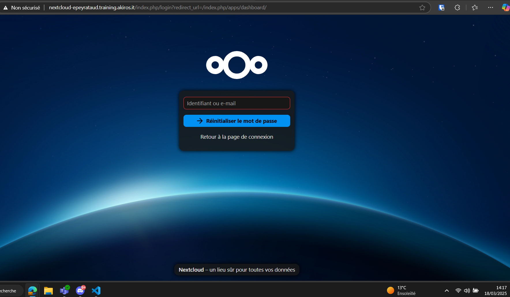
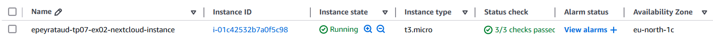
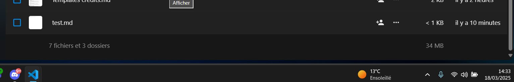
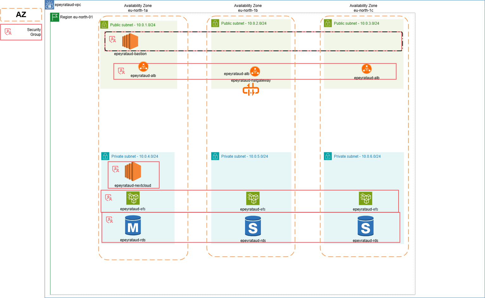

# TP7 - Exercice 2
## Contexte
Maintenant que l'application Nextcloud est déployée et accessible via l'ALB, l'équipe de direction souhaite améliorer la résilience de l'infrastructure. 

L'objectif est de pouvoir gérer la reprise d'activité en cas de panne d'une AZ ou d'une instance EC2 et également de préparer le terrain pour une gestion automatique de la capacité en fonction de la charge.

On vous demande de travailler conjointement avec l'équipe DevOps afin de mettre en place un Auto Scaling Group (ASG) pour gérer dynamiquement les instances Nextcloud. Cette solution devra permettre de relancer automatiquement une instance EC2 dans une autre AZ en cas de panne.


## Objectifs
* Suivre les instructions de l'équipe DevOps pour mettre en place un Auto Scaling Group pour les instances Nextcloud.
* Tester le déploiement initial de l'Auto Scaling Group sans scaling policy.
* Simuler une panne d'AZ et vérifier que l'application est automatiquement redéployée dans une autre AZ sans perte de données.

## Etapes de réalisation
### 📌 1. Création d’une AMI de l’instance Nextcloud existante

#### Consignes
* Créer une AMI à partir de l'instance Nextcloud existante une fois que l'application est configurée et fonctionnelle.
* Le processus de création automatique de l'AMI sera réalisé par l'équipe DevOPS dans un second temps.
* Pour cette étape, vous pouvez créer l'AMI manuellement dans la console AWS.
* Assurez-vous que l'AMI soit nommée de manière explicite pour faciliter son identification `<username>-<tp_directory>-nextcloud-<date>`.
* Assurez-vous que l'AMI soit correctement taggée (tags `Name` et `Owner`).

---

#### Mise en place
1. Accéder à la **console AWS** → **EC2** → **Instances**.
2. Sélectionner l'instance Nextcloud et cliquer sur **"Créer une image"**.
3. Donner un nom explicite, par ex. :  
   **`epeyrataud-ami-nextcloud`**
4. Vérifier que l’AMI est bien créée dans **Images > AMI**
5. Ajouter les tags :
   - `Name = epeyrataud-ami-nextcloud`
   - `Owner = epeyrataud`

### 📌 2. Récupération de l’ID de l’AMI en Terraform
#### Consignes
* Créer la configuration Terraform pour récupérer dynamiquement l'ID de l'AMI créée précédemment.
* Cette configuration devra récupérer l'ID de l'AMI la plus récente qui correspond aux critères de rechercher suivants :
* Le nom de l'AMI doit commencer par `<username>-ami-nextcloud`.
* L'AMI doit être dans un état disponible (available).
* L'AMI doit avoir comme propriétaire le compte AWS actuel (self).

#### Mise en place
Ajout du bloc Terraform pour récupérer dynamiquement l’AMI la plus récente :
 `aws.tf`
```hcl
data "aws_ami" "nextcloud" {
  most_recent = true
  owners      = ["self"]

  filter {
    name   = "name"
    values = ["${local.user}-tp_07-nextcloud-*"]
  }

  # Filtre pour récupérer une AMI disponible
  filter {
    name   = "state"
    values = ["available"]
  }
}

output "ami_id" {
  value = data.aws_ami.nextcloud.id
}

output "ami_name" {
  value = data.aws_ami.nextcloud.name
}
```
### 📌 3. Création du Launch Template
#### Consigne
* Créer la configuration Terraform qui déploie un Launch Template.
    * Utiliser l'AMI créée précédemment.
    * Configurer les paramètres des instances de manière identique à ce qui avait été fait pour l'instance EC2 nextcloud (type, key, security group) à l'exception du userdata qui ne servira plus.
    * Ne pas oublier de configurer les tags pour :
        * le launch Template
        * les instances
        * les volumes
        * les interfaces réseau

#### Mise en place
Un Launch Template définit comment les instances seront créées dans l’ASG.
:file_folder: `asg.tf`

```hcl
# Template pour la création d'un ASG
# Cette ressource définit une ressource aws_launch_template, pour créer un launch template
resource "aws_launch_template" "nextcloud" {
  name_prefix            = "${local.name}-nextcloud-lt"
  image_id               = data.aws_ami.nextcloud.id
  instance_type          = "t3.micro"
  key_name               = aws_key_pair.nextcloud.key_name
  vpc_security_group_ids = [aws_security_group.nextcloud_sg.id]

  tag_specifications {
    resource_type = "instance"
    tags = {
      Name  = "${local.name}-nextcloud-instance"
      Owner = local.user
    }
  }

  tag_specifications {
    resource_type = "volume"
    tags = {
      Name  = "${local.name}-nextcloud-volume"
      Owner = local.user
    }
  }
}

```
### 📌 4. Création de l’Auto Scaling Group
#### Consigne
* Créer la configuration Terraform qui déploie un Auto Scaling Group nommé `<username>-<tp_directory>-nextcloud`.
* Cette première configuration ne gérera pas la capacité automatiquement, elle sera utilisée pour tester le déploiement initial de l'ASG :
    * Utiliser le Launch Template créé précédemment dans sa version la plus récente.
    * Configurer le nombre d'instances minimum, désiré et maximum à 1.
    * Configurer le type de health check sur le Load Balancer.
    * Configurer les sous-réseaux où les instances EC2 seront déployées de sorte à ce qu'elles soient réparties sur les 3 AZ.
    * Configurer le rattachement automatique des instances au target group utilisé par l'ALB.
    * Configurer les tags pour l'ASG comme ceci :-1: 
    ```
    tag {
      key                 = "Owner"
      value               = local.user
      propagate_at_launch = false
    }
    ```

#### Mise en place
:file_folder: `asg.tf`
L’ASG déploiera une instance et la relancera en cas de panne.

```hcl
resource "aws_autoscaling_group" "nextcloud" {
  name                = "${local.name}-nextcloud-asg"
  desired_capacity    = 1                                    
  min_size            = 1                                    
  max_size            = 1                                    
  vpc_zone_identifier = [for s in aws_subnet.private : s.id] 

  # Utiliser le Launch Template pour créer les instances
  launch_template {
    id      = aws_launch_template.nextcloud.id
    version = "$Latest"
  }

  health_check_type         = "ELB"                               
  health_check_grace_period = 300                                
  target_group_arns         = [aws_lb_target_group.nextcloud_tg.arn]

  # Définition des tags pour l'ASG
  tag {
    key                 = "Owner"
    value               = local.user
    propagate_at_launch = false
  }

  tag {
    key                 = "Name"
    value               = "${local.name}-nextcloud-asg"
    propagate_at_launch = false
  }
}

data "aws_instances" "nextcloud_asg" {
  filter {
    name   = "tag:aws:autoscaling:groupName"
    values = [aws_autoscaling_group.nextcloud.name]
  }
}

output "asg_instances_nextcloud_private_ips" {
  value = data.aws_instances.nextcloud_asg.private_ips
}
```

Ajout d'output pour récupérer l'IP privée des instances Nextcloud
```
data "aws_instances" "nextcloud_asg" {
  filter {
    name   = "tag:aws:autoscaling:groupName"
    values = [aws_autoscaling_group.nextcloud.name]
  }
}

output "asg_instances_nextcloud_private_ips" {
  value = data.aws_instances.nextcloud_asg.private_ips
}
```

### 📌 5. Suppression de l’ancienne instance Nextcloud
Commenter la ressource Terraform existante dans le fichier :file_folder: `ec2.tf` et commenter le `target group attachment` dans le fichier :file_folder: `target_group.tf`:

```
# resource "aws_instance" "nextcloud" {
#   ami                    = "ami-09a9858973b288bdd"
#   instance_type          = "t3.micro"
#   subnet_id              = aws_subnet.private["b"].id
#   key_name               = aws_key_pair.nextcloud.key_name
#   vpc_security_group_ids = [aws_security_group.nextcloud_sg.id]
#   user_data              = local.nextcloud_userdata
#   depends_on             = [aws_route_table_association.private]
#   tags = {
#     Name = "${local.name}-nextcloud"
#   }
# }
```

```
# # Attach the Nextcloud instance to the target group
# resource "aws_lb_target_group_attachment" "nextcloud_attachment" {
#   target_group_arn = aws_lb_target_group.nextcloud_tg.arn
#   target_id        = aws_instance.nextcloud.id
#   port             = 80
# }
```

### 📌6. Déploiement de l'Auto Scaling Group

Puis appliquer les changements :
```
terraform apply
```
> ⚠️ L’ancienne instance sera supprimée, et une nouvelle sera lancée via l’ASG.

## ✅ Test de la résilience
1. Connexion à Nextcloud et vérification de l'accès.

2. Création d’un fichier dans Nextcloud.

3. Simuler une panne :
    * AWS Console → EC2 → sélection de l'instance Nextcloud → Actions → Instance State → Terminate.
    * instance actuelle
    

    * suppression de l'instance
    
    
4. Attente quelques minutes, puis vérification :
    * création automatique d'une nouvelle instance
    

    * fichier :file_folder: `test.md` toujours présent 
    

* Une nouvelle instance est créée dans une autre AZ ? ✅
* L'application Nextcloud reste accessible via l’ALB? ✅
* Le fichier précédemment créé est toujours là (test de persistance des données)? ✅

### Schéma 


## Conclusion

### ✅ Objectifs atteints
✔ Auto Scaling Group opérationnel
✔ Gestion automatique des pannes
✔ Test de persistance des données réussi