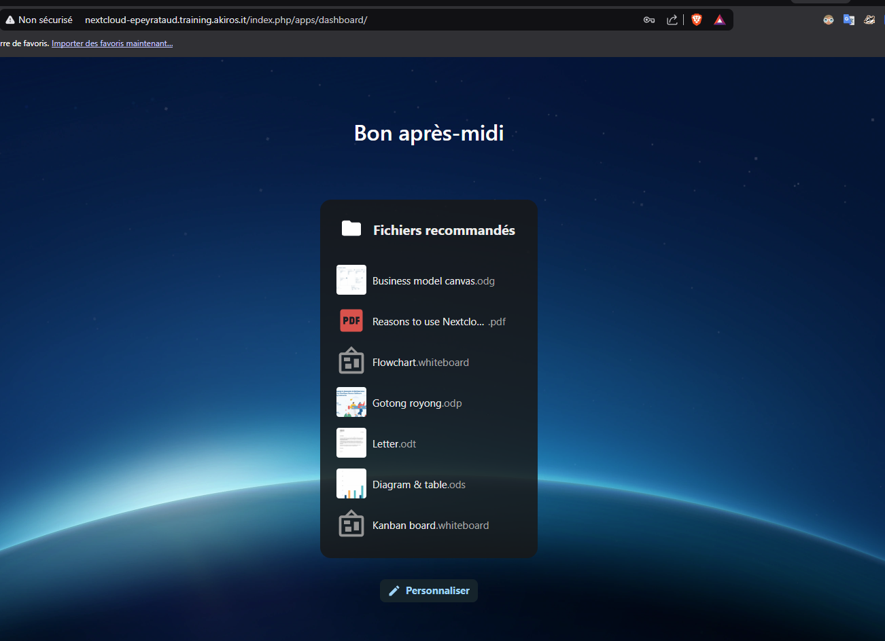
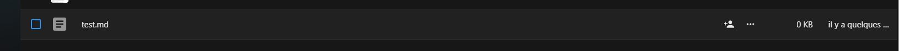
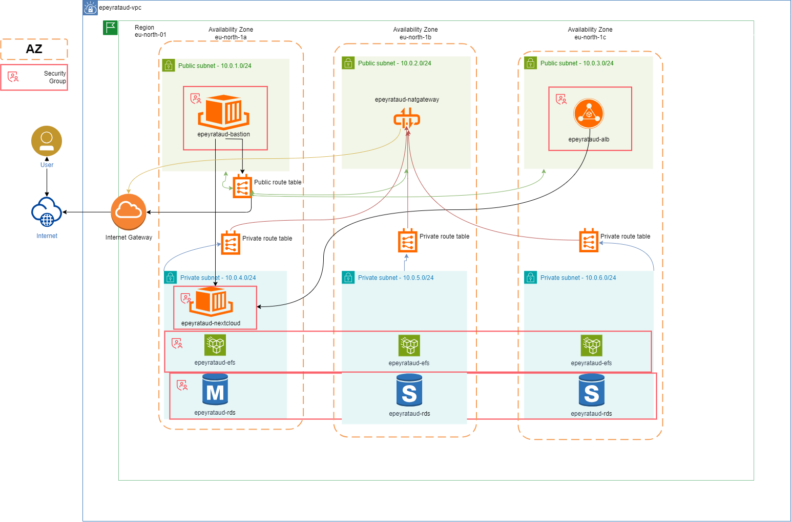

## TP-07-EX01

#### Connexion au Nextcloud



#### Création d'un fichier 'test.md'



### Simulation d'une panne d'AZ

- On change l'AZ dans le fichier `instances.tf` en remplacant a par b :


- On se connecte sur le nextcloud pour vérifier que le fichier est toujours existant :


> Il existe !

Sur le site d'aws, on peut vérifier que la nouvelle instance à bien changé d'AZ


#### L'accès à l'application est restreint aux adresses IP de l'entreprise

```
resource "aws_security_group" "alb_sg" {
  name        = "${local.name}-alb-sg"
  description = "Security group for ALB"
  vpc_id      = aws_vpc.main.id

  ingress {
    from_port       = 80
    to_port         = 80
    protocol        = "tcp"
    cidr_blocks     = ["31.34.142.177/32"] # Autoriser uniquement Nextcloud
    description     = "Autoriser http"
  }

  egress {
    from_port   = 0
    to_port     = 0
    protocol    = "-1"
    cidr_blocks = ["0.0.0.0/0"]
  }

  tags = {
    Name = "${local.name}-alb-sg"
  }
}
```
#### Schéma

